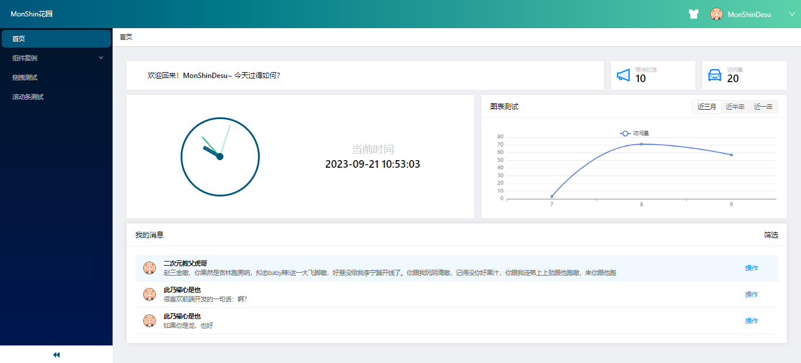

# react-ts-app
基于React + Less + TypeScript + Ant Design搭建的后台管理系统模板

## 前言
该系统是以react+antd为基础开发的一套后台系统模板。除登录注销等基本功能外，还将分页查询、表单提交等常用重型功能组件化，使用简单轻便√ 并且依赖尽可能使用新版本，拥有新特性的同时易于版本控制，远离install版本问题烦恼... 开发代码轻量，结构清晰，易于理解~（大概x）

## 特性
- 登录注销功能
- 动态获取菜单栏
- 自适应布局（目前还不支持竖屏.....）
- 搭配Ant Design的全局换肤功能
- 单页应用/多标签应用自由切换
- 舒适的动画效果..
- 高度可配置化的组件（比如：分页查询、表单提交...）
- 简单便利的工具类和hooks
- 支持mock数据
- echarts图表自然也是有的√
- 适合多环境脚本打包发布的配置

## 预览
### 登录页面

### 首页

## 后话
目前项目还在不断完善中，咱个人也有很多想法未实现。慢慢来吧！